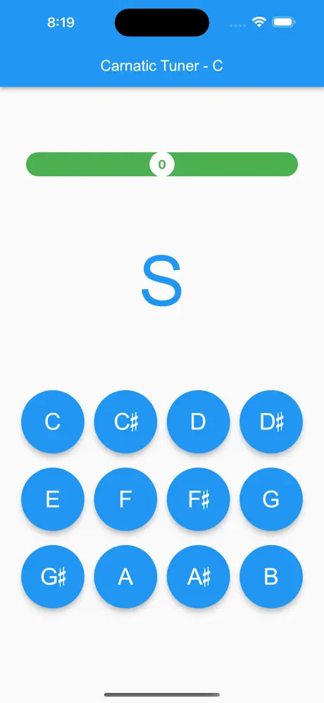
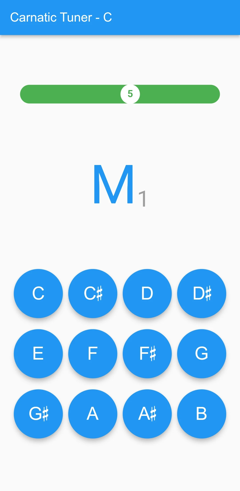
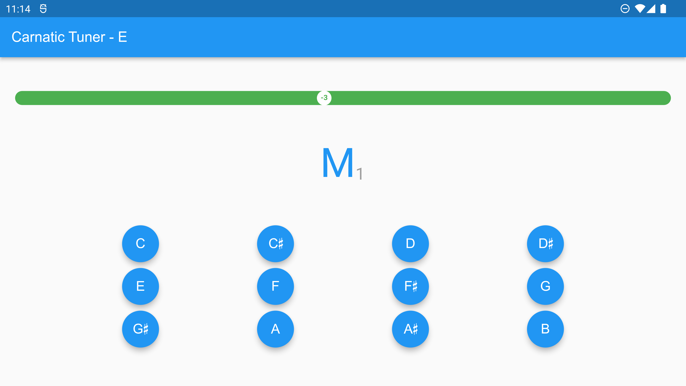

<kbd> 

</kbd>

# CarnaticTuner

CarnaticTuner is the only free and open source tuner app for Carnatic instruments. Whether you play the Carnatic violin, veena, flute, sitar, or do Carnatic vocals, this app is for you!

## Features
- Accurate Carnatic tuning with specific Carnatic pitch intervals
- Select the base pitch easily
- Upper bar to indicate accuracy

## How To Use
Just download the app and start playing! Select the pitch you want to tune your instrument to! For example, most violin players tune to D# or E.

  

## Technical Brief

This app was built with Flutter for cross-platform support. The FFT algorithm is used for converting the audio samples into freqency domain, to allow for precise pitch determination.

The source code can be found in [`./lib`](./lib)
